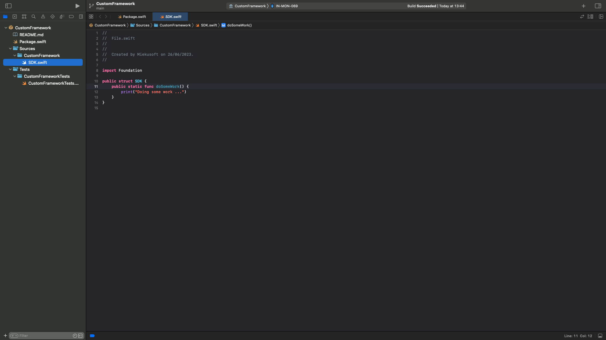
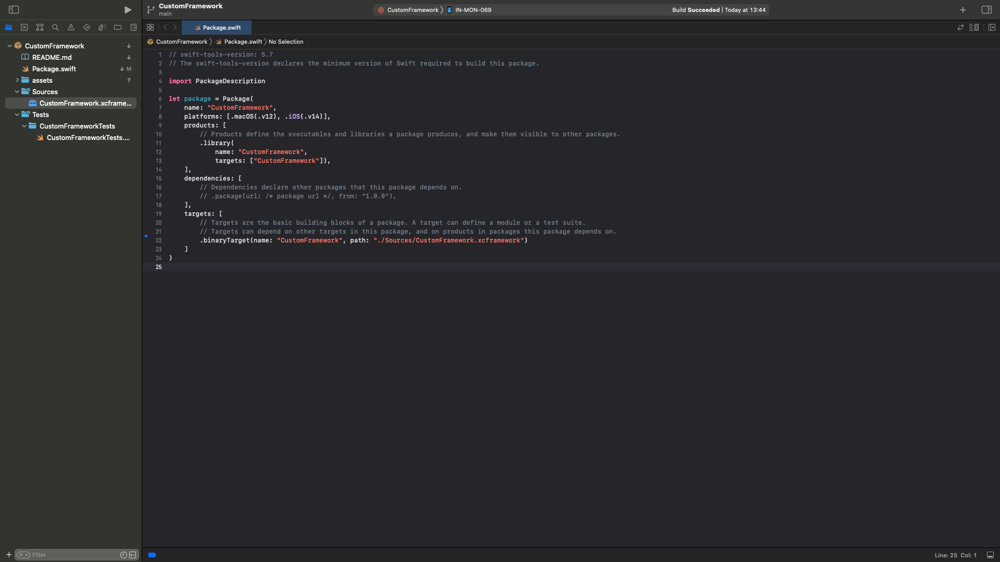

# CustomFramework

## Create Package proj

In Xcode
1. File -> New -> Package...

## Open-source

1. In `Package.swift` use `target` in targets array

```swift
let package = Package(
    name: "CustomFramework",
    platforms: [.macOS(.v12), .iOS(.v14)],
    products: [
        .library(
            name: "CustomFramework",
            targets: ["CustomFramework"]),
    ],
    dependencies: [],
    targets: [
        .target(
            name: "CustomFramework",
            dependencies: []),
        .testTarget(
            name: "CustomFrameworkTests",
            dependencies: ["CustomFramework"]),
    ]
)
```

2. Put source code into `Source` directory


## Binary target

1. In `Package.swift` use `binaryTarget` in targets array

```swift
let package = Package(
    name: "CustomFramework",
    platforms: [.macOS(.v12), .iOS(.v14)],
    products: [
        .library(
            name: "CustomFramework",
            targets: ["CustomFramework"]),
    ],
    dependencies: [],
    targets: [
        .binaryTarget(name: "CustomFramework", path: "./Sources/CustomFramework.xcframework")
    ]
)
```

2. Put xcframework output build in `Source` directory
Do this operation by drag and drop build output from Finder to XCode file tree.


## Packages versioning
Add git tag
```bash
$ git tag 0.0.1
```

Push git tags
```bash
$ git push --tags
```